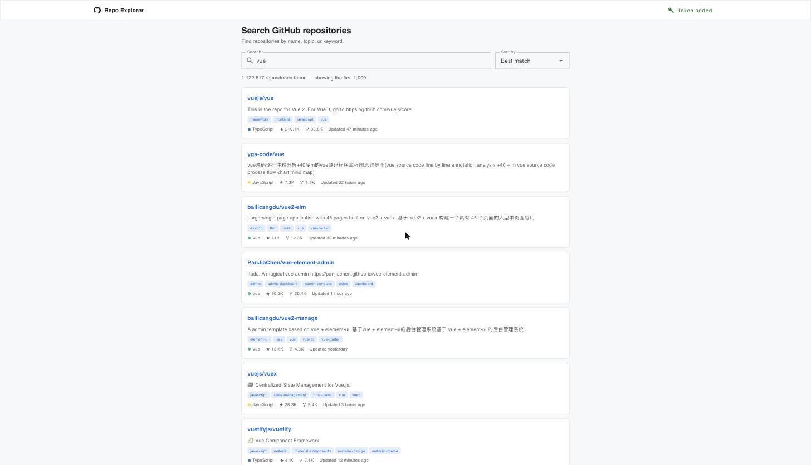
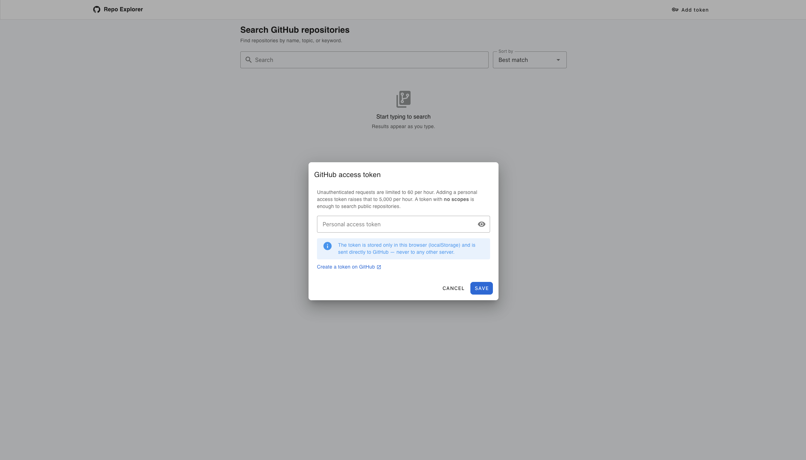
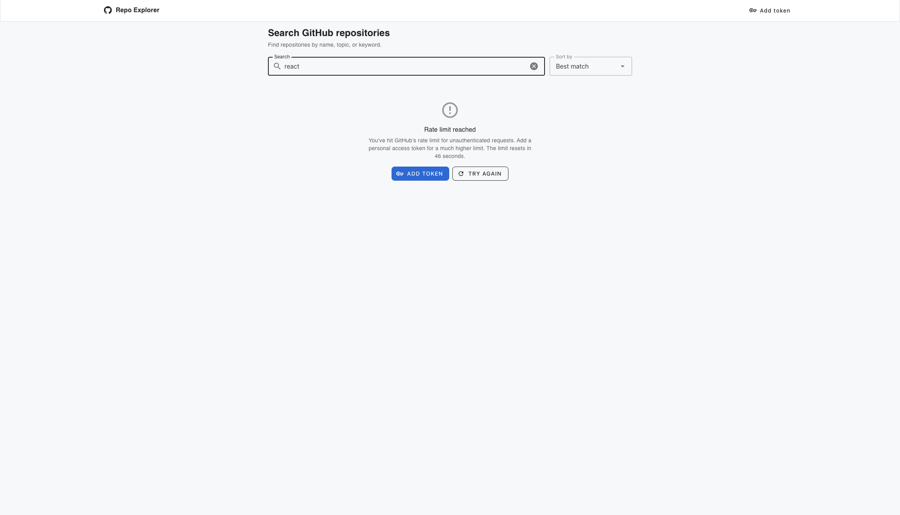

# GitHub Repository Explorer

Search GitHub repositories and open a repository to see its details. It's a
single-page app that talks straight to the public GitHub REST API — no backend.

**Live:** https://akunin94.github.io/github-repository-explorer/

## Tech

Vue 3 Composition API (`<script setup>`) · TypeScript (strict) · Vuetify 3 · SCSS · Pinia ·
Vue Router · Vite · Vitest.

## Run it

```bash
npm install
npm run dev      # start the dev server
npm run test     # run unit tests
npm run build    # type-check and build
```

## Notes

- **A token is optional.** The app works without one. You can paste a GitHub
  personal access token in the UI to get a higher rate limit. The token stays in
  your browser (localStorage) and is sent only to GitHub — it is never built into
  the app, because a static site can't keep a secret safe.
- **Rate limits are handled.** Repeated identical requests are cached, and when
  you hit a limit the app explains it, offers to add a token, and retries once
  you do.
- **Edge cases over features.** Empty and invalid queries, no results, 404s,
  network errors, missing fields, fast typing (debounced and cancelled), long
  text, and GitHub's 1,000-result search cap all show clear states.
- **Static hosting.** The router uses hash history and Vite's base is relative,
  so deep links and refreshes work on GitHub Pages. Pushing to `main` runs the
  tests and deploys via GitHub Actions.

## AI assistance

I used AI (Claude) while building this — for scaffolding, tests, and drafting
this README — and reviewed everything it produced.

## Screenshots

Search:



Repository detail:


Token modal:



Rate limit reached:


